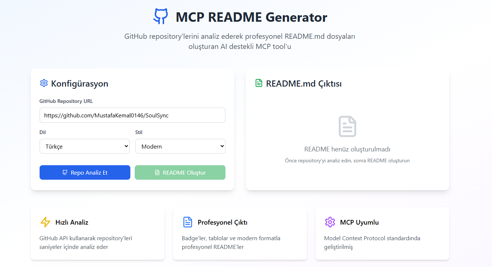

# 🤖 MCP GitHub README Generator

[](https://modelcontextprotocol.io)
[](https://www.typescriptlang.org/)
[](https://reactjs.org/)
[](https://choosealicense.com/licenses/mit/)
[](https://github.com/MustafaKemal0146/github-readme-generator-mcp/stargazers)

> 🚀 **AI destekli GitHub repository analizi ile otomatik README.md oluşturucu**
>
> Model Context Protocol (MCP) standardında geliştirilmiş, akıllı analiz yapan hibrit tool

## 📸 Proje Önizlemesi

<div align="center">



*Modern web arayüzü ile GitHub repository analizi ve README.md oluşturma*

</div>

## ✨ Özellikler

- 🔍 **Derin Repo Analizi** - Tüm dosya yapısını ve teknolojileri otomatik tespit
- 📝 **Akıllı İçerik Üretimi** - Proje türüne göre özelleştirilmiş README bölümleri
- 🌐 **Çoklu Kullanım Modu** - MCP tool'u VEYA web arayüzü olarak kullanım
- 🎨 **Modern Tasarım** - Badge'ler, ikonlar ve responsive layout
- ⚡ **Hızlı Kurulum** - Tek komutla çalışır duruma gelir
- 🔧 **n8n Entegrasyonu** - Workflow automation desteği
- 🤝 **MCP Standartları** - Model Context Protocol ile tam uyumlu

## 🛠️ Teknoloji Yığını

| Kategori | Teknolojiler |
|----------|-------------|
| **Frontend** |    |
| **MCP Server** |   |
| **Build Tool** |  |
| **AI Providers** |    |
| **Automation** |  |

## 🎯 Kullanım Modları

### 1. 🌐 Web Arayüzü Modu

Modern, kullanıcı dostu web arayüzü ile:

```bash
# Geliştirme sunucusunu başlat
npm run dev

# Production build
npm run build
```

**Özellikler:**
- Görsel repository analizi
- Gerçek zamanlı README önizleme
- Drag & drop dosya yükleme
- Responsive tasarım

### 2. 🤖 MCP Tool Modu

AI client'ları (Claude, Cursor, Continue.dev) ile entegrasyon:

```bash
# MCP server'ı build et
npm run build:mcp

# MCP server'ı başlat
npm run mcp
```

**Desteklenen AI Client'lar:**
- Claude Desktop
- Cursor IDE
- Continue.dev
- Diğer MCP uyumlu client'lar

### 3. 🔄 n8n Workflow Modu

Otomatik README oluşturma workflow'ları:

```bash
# n8n workflow'unu import et
# n8n-workflows/readme-generator-workflow.json
```

## 📸 Önizleme

### Web Arayüzü
```
 🎯 GitHub Repo Analizi
┌─────────────────────────────────────────────┐
│  https://github.com/user/awesome-project    │
│  ↓ Dosya tarama ve analiz                   │
│  ✅ package.json → React + TypeScript       │
│  ✅ src/ klasörü → Komponent yapısı         │
│  ✅ API endpoints → Backend entegrasyonu    │
└─────────────────────────────────────────────┘
 
 📝 Otomatik README.md Üretimi
┌─────────────────────────────────────────────┐
│  ✨ Proje başlığı + badge'ler               │
│  📋 Özellik listesi                         │
│  🛠️ Teknoloji yığını                        │
│  ⚡ Kurulum adımları                        │
│  📖 Kullanım rehberi                        │
│  🤝 Katkı kılavuzu                          │
└─────────────────────────────────────────────┘
```

### MCP Tool Kullanımı
```
Claude: "Bu GitHub repository için README oluştur: https://github.com/facebook/react"

MCP Tool: ✅ Repository analiz ediliyor...
         ✅ Teknolojiler tespit ediliyor...
         ✅ README.md oluşturuluyor...
         
📄 Profesyonel README.md hazır!
```

## 🚀 Hızlı Başlangıç

### Ön Gereksinimler

- Node.js 18+ 
- npm veya yarn
- GitHub token (opsiyonel, rate limit için)

### Kurulum

```bash
# Repository'yi klonlayın
git clone https://github.com/yourusername/mcp-readme-generator.git
cd mcp-readme-generator

# Bağımlılıkları yükleyin
npm install

# Environment variables'ları ayarlayın
cp .env.example .env
# .env dosyasını düzenleyin

# Web arayüzü için
npm run dev

# MCP server için
npm run build:mcp
npm run mcp
```

### MCP Entegrasyonu

#### Claude Desktop

`~/Library/Application Support/Claude/claude_desktop_config.json`:

```json
{
  "mcpServers": {
    "readme-generator": {
      "command": "node",
      "args": ["./dist/mcp-server.js"],
      "env": {
        "GITHUB_TOKEN": "your_github_token"
      }
    }
  }
}
```

#### Continue.dev

`.continue/config.json`:

```json
{
  "mcpServers": [
    {
      "name": "readme-generator",
      "command": "node ./dist/mcp-server.js"
    }
  ]
}
```

## 📚 Kullanım Örnekleri

### Web Arayüzü

1. Tarayıcıda `http://localhost:5173` açın
2. GitHub repository URL'ini girin
3. Dil ve stil seçeneklerini ayarlayın
4. "Analiz Et" butonuna tıklayın
5. README'yi indirin

### MCP Tool

```typescript
// Claude ile kullanım
"Bu repository için Türkçe README oluştur: https://github.com/vercel/next.js"

// Cursor ile kullanım
"Analyze this repo and generate a detailed README: https://github.com/microsoft/vscode"
```

### n8n Workflow

```bash
# Webhook'a POST request
curl -X POST https://your-n8n.com/webhook/readme-webhook \
  -H "Content-Type: application/json" \
  -d '{
    "repoUrl": "https://github.com/user/project",
    "config": {
      "language": "tr",
      "style": "modern",
      "notify": true
    }
  }'
```

## 📁 Proje Yapısı

```
mcp-readme-generator/
├── 📁 src/
│   ├── 📁 components/         # React bileşenleri
│   │   └── MCPDemo.tsx        # Ana demo bileşeni
│   ├── 📄 mcp-server.ts       # MCP server implementation
│   ├── 📄 App.tsx             # React app
│   └── 📄 main.tsx            # Entry point
├── 📁 docs/                   # Dokümantasyon
│   ├── 📄 MCP_INTEGRATION.md  # MCP entegrasyon rehberi
│   ├── 📄 N8N_SETUP.md       # n8n kurulum rehberi
│   └── 📄 EXAMPLE_OUTPUT.md   # Örnek çıktılar
├── 📁 n8n-workflows/         # n8n workflow dosyaları
│   └── 📄 readme-generator-workflow.json
├── 📄 package.json
├── 📄 mcp-config.json         # MCP konfigürasyonu
├── 📄 .env.example           # Environment variables
└── 📄 README.md
```

## 🔧 API Referansı

### MCP Tools

#### `generate_readme`

GitHub repository için README.md oluşturur.

**Parametreler:**
- `repoUrl` (string, required): GitHub repository URL'i
- `language` ('tr' | 'en' | 'multi'): Çıktı dili (default: 'en')
- `style` ('minimal' | 'modern' | 'detailed'): README stili (default: 'modern')
- `includeBadges` (boolean): Badge'leri dahil et (default: true)
- `includeTree` (boolean): Proje ağacını dahil et (default: true)

#### `analyze_repository`

Repository yapısını ve teknolojilerini analiz eder.

**Parametreler:**
- `repoUrl` (string, required): GitHub repository URL'i
- `deep` (boolean): Derin analiz yap (default: false)

#### `trigger_n8n_workflow`

n8n workflow'unu tetikler.

**Parametreler:**
- `webhookUrl` (string, required): n8n webhook URL'i
- `repoUrl` (string, required): GitHub repository URL'i
- `config` (object): Konfigürasyon ayarları

### Response Format

```typescript
interface ReadmeResult {
  success: boolean;
  analysis: {
    name: string;
    description: string;
    technologies: string[];
    projectType: 'frontend' | 'backend' | 'fullstack' | 'cli' | 'library';
    hasTests: boolean;
    hasCI: boolean;
  };
  readme: string;
  metadata: {
    generatedAt: string;
    language: string;
    style: string;
  };
}
```

## 🌟 Desteklenen Proje Türleri

- ✅ **Frontend**: React, Vue, Angular, Svelte
- ✅ **Backend**: Node.js, Python, Rust, Go
- ✅ **Mobile**: React Native, Flutter
- ✅ **Desktop**: Electron, Tauri
- ✅ **CLI Tools**: Node.js, Python, Rust
- ✅ **Libraries**: npm packages, Python packages

## 🔄 n8n Workflow Özellikleri

### Otomatik İşlemler

- Repository analizi
- Teknoloji tespiti
- README oluşturma
- Email bildirimi (opsiyonel)
- Webhook response

### Konfigürasyon

```json
{
  "repoUrl": "https://github.com/user/project",
  "config": {
    "language": "tr",
    "style": "modern",
    "includeBadges": true,
    "includeTree": true,
    "notify": true
  }
}
```

## 🤝 Katkıda Bulunma

Projeye katkıda bulunmak için:

1. 🍴 **Fork** edin
2. 🌟 **Feature branch** oluşturun: `git checkout -b feature/amazing-feature`
3. 💾 **Commit** yapın: `git commit -m 'feat: add amazing feature'`
4. 📤 **Push** edin: `git push origin feature/amazing-feature`
5. 🔄 **Pull Request** açın

### Geliştirme Ortamı Kurulumu

```bash
# Repository'yi fork edin ve klonlayın
git clone https://github.com/yourusername/mcp-readme-generator.git

# Bağımlılıkları yükleyin
npm install

# Web arayüzünü başlatın
npm run dev

# MCP server'ı test edin
npm run build:mcp
npm run mcp
```

## 📋 Roadmap

- [ ] 🎨 **Custom Template System** - Kullanıcı tanımlı şablonlar
- [ ] 🔍 **Advanced Analytics** - Kod kalitesi analizi
- [ ] 🌐 **Multi-language Support** - Daha fazla dil desteği
- [ ] 📊 **Statistics Dashboard** - Proje istatistikleri
- [ ] 🔗 **GitHub Actions Integration** - CI/CD entegrasyonu
- [ ] 📱 **Mobile App** - React Native companion app
- [ ] 🤖 **More AI Providers** - Groq, Cohere, local models

## 🚨 Troubleshooting

### GitHub Rate Limit

```bash
# GitHub token ekleyin
export GITHUB_TOKEN=your_token_here
```

### MCP Server Başlatma

```bash
# Build kontrolü
npm run build:mcp

# Server test
node dist/mcp-server.js --help
```

### n8n Webhook

```bash
# Webhook test
curl -X POST your-webhook-url \
  -H "Content-Type: application/json" \
  -d '{"repoUrl": "https://github.com/test/repo"}'
```

## 📄 Lisans

Bu proje [MIT Lisansı](LICENSE) altında lisanslanmıştır.

## 🙏 Teşekkürler

- [Model Context Protocol](https://modelcontextprotocol.io) - MCP standartları için
- [GitHub API](https://docs.github.com/en/rest) - Repository analizi için
- [OpenAI](https://openai.com) - AI destekli içerik üretimi için
- [n8n](https://n8n.io) - Workflow automation için
- [Shields.io](https://shields.io) - Güzel badge'ler için

## 📞 İletişim

- 🛜 WebSite: https://mustafakemalcingil.site/
- 📧 Email: ismustafakemal0146@gmail.com
- 💼 LinkedIn: [mustafakemal0146](https://linkedin.com/in/mustafakemal0146)

---

<div align="center">

**🌟 Bu projeyi beğendiyseniz yıldız vermeyi unutmayın!**

[](https://github.com/MustafaKemal0146/github-readme-generator-mcp/stargazers)
[](https://github.com/MustafaKemal0146/github-readme-generator-mcp/network/members)
[](https://github.com/MustafaKemal0146/github-readme-generator-mcp/watchers)


</div>

---

<div align="center">
✨ Bu README.md, Model Context Protocol (MCP) ile güçlendirilmiş yapay zekanın sihirli dokunuşuyla otomatik olarak oluşturuldu. ✨

</div>
